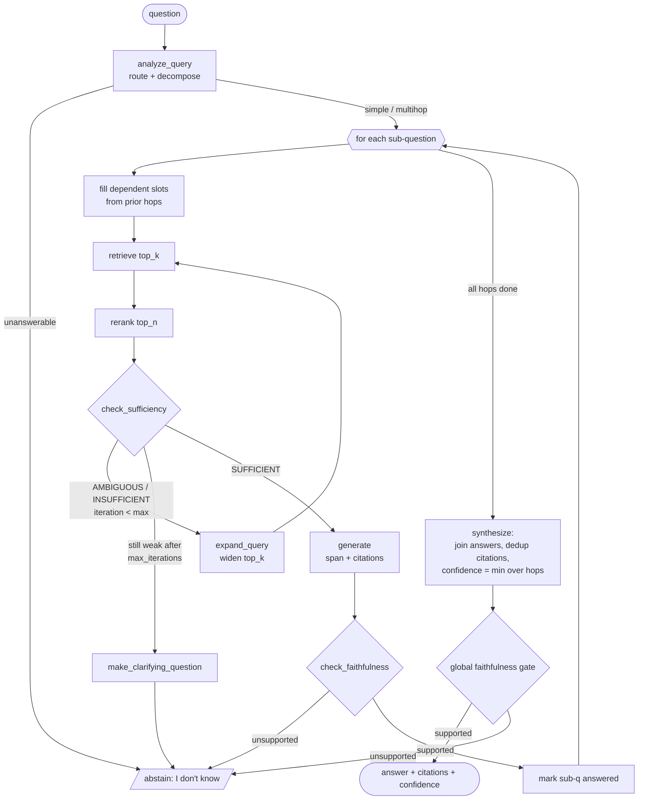

# Agentic AI Component

> Assignment §7 — Project #3 "Knowledge Base Question-Answering System" (`kbqa`).
> Author: Le Dinh Minh Quan (23127460). Scope: the deterministic agentic controller that drives the RAG-over-documents pipeline.

## 1. Design Philosophy

The agent is a **deterministic state machine**, not a free-running LLM loop. It composes three well-established control patterns over the retrieval pipeline:

- **Corrective-RAG (CRAG, arXiv 2401.15884)** — a bounded correction loop that detects weak retrieval and retries with query expansion / wider `top_k` instead of answering on bad context.
- **Self-RAG reflection (arXiv 2310.11511)** — explicit `ISREL` (relevance/sufficiency) and `ISSUP` (support/faithfulness) reflection gates that decide whether to proceed or abstain.
- **Rewrite-Retrieve-Read + decompose (arXiv 2305.14283)** — query rewriting and multi-hop decomposition before retrieval.

Every decision node ships a **no-LLM heuristic default** so the whole agent runs on CPU with zero paid API. An **optional local LLM brain** (`google/flan-t5-base`, or `Qwen/Qwen2.5-1.5B-Instruct`) upgrades exactly **three** nodes — decompose, sufficiency, faithfulness — without changing the control flow. The agent **never answers from parametric memory**: the faithfulness gate requires entailment from retrieved context, otherwise it abstains with "I don't know".

Thresholds (verified): `TAU_HIGH = 0.55`, `TAU_LOW = 0.15`, `max_iterations = 3`.

## 2. Tools and Contracts (`kbqa.agent.tools`)

The controller is a thin orchestrator over **eight** typed tools. Each tool is pure (state in → result out) and emits a `ToolTrace` record for the audit log.

| # | Tool | Signature (in → out) | No-LLM default | LLM-brain upgrade |
|---|------|----------------------|----------------|-------------------|
| 1 | `analyze_query` | `q -> {qtype, rewritten, sub_questions[{text, depends_on}]}` | Rule-based: multi-hop cue words (`and / whose / that / before / most / compared to`), coreference, >1 NER span; acronym + thesaurus rewrite | Few-shot decomposition prompt |
| 2 | `retrieve` | `query, top_k=20, filters -> list[Retrieved]` | FAISS dense (bge) + optional BM25, fused with **RRF**; `IndexFlatIP` <100k chunks, `IndexHNSWFlat(M=32)` ≥100k | — (deterministic) |
| 3 | `rerank` | `query, cands, top_n=5 -> list[Retrieved]` | `cross-encoder/ms-marco-MiniLM-L-6-v2`, sets `.rerank_score` | `BAAI/bge-reranker-v2-m3` (GPU swap) |
| 4 | `check_sufficiency` | `query, ctx -> {verdict, score, missing_terms}` | Threshold on top rerank score + content-word coverage (see §4.2) | Self-RAG `ISREL` |
| 5 | `generate` | `query, ctx -> {answer, citations[{source, chunk_id, span}]}` | Extractive `deepset/roberta-base-squad2` (span + source chunk, null-score abstain) | `google/flan-t5-base` "answer using ONLY context; cite [chunk_id]" |
| 6 | `check_faithfulness` | `answer, ctx -> {supported, support_score}` | NLI entailment over (cited chunks → answer); fallback lexical/embedding overlap via `bge-base-en-v1.5` | Self-RAG `ISSUP` |
| 7 | `make_clarifying_question` | `state -> str` | Template from `missing_terms` when ambiguous after expansion | LLM-phrased clarification |
| 8 | `kg_query` *(pluggable)* | `logical_form -> rows` | ChatKBQA-style NL→SPARQL backend; same `AgentState`, citations = triples | — |

> **Verification note (faithfulness NLI).** The candidate NLI model `cross-encoder/nli-deberta-v3-small` was **not** verified on the Hub in the research phase. The shipped default therefore uses the **verified** `BAAI/bge-base-en-v1.5` embedding-overlap entailment proxy (or the verified `cross-encoder/ms-marco-MiniLM-L-6-v2` rerank score as a groundedness proxy). The NLI model is wired in only after Hub verification.

### ToolTrace audit

Every tool call appends a record to `state.trace`:

```
ToolTrace = {
  step: int,            # monotonic
  tool: str,            # e.g. "retrieve"
  inputs: dict,         # query, top_k, sub_question_id, ...
  outputs_summary: dict,# scores, verdict, n_candidates, chosen chunk_ids
  decision: str,        # e.g. "AMBIGUOUS -> expand+retry"
  latency_ms: float
}
```

This makes every answer fully reconstructable: which sub-question, which chunks, which scores, which branch was taken, and why an answer was emitted or abstained. The trace is surfaced verbatim in the `/ask` response when `return_trace=true`.

## 3. AgentState

A single dataclass is threaded through the loop (verified fields from the brief):

```
AgentState:
  question: str
  rewritten_query: str
  qtype: "simple" | "multihop" | "unanswerable"
  sub_questions: list[SubQuestion]
  contexts: list[Retrieved]
  sufficiency: {score, verdict, missing_terms}
  answer: str
  citations: list[{source, chunk_id, span}]
  faithful: bool
  confidence: float
  # control fields
  iteration: int
  max_iterations: int = 3
  needs_clarification: bool
  clarifying_question: str
  trace: list[ToolTrace]

SubQuestion: {text, depends_on, answer, citations, contexts,
              status: "pending"|"answered"|"insufficient"|"failed"}

Retrieved: {doc_id, chunk_id, text, source, dense_score, rerank_score}
```

## 4. The Three Decision Points (the agentic core)

### 4.1 Decision 1 — Route (`analyze_query`)

Classifies `qtype` and routes:

- **simple** → single retrieve→rerank→read pass.
- **multihop** → decompose into ordered `sub_questions` with `depends_on` slots; run the per-hop loop.
- **unanswerable** → short-circuit to immediate "I don't know" (no retrieval cost).

### 4.2 Decision 2 — Sufficiency loop (`check_sufficiency`, CRAG)

Heuristic verdict on each retrieval result:

| Condition | Verdict | Action |
|-----------|---------|--------|
| top rerank ≥ `TAU_HIGH` (0.55) | **SUFFICIENT** | proceed to `generate` |
| `TAU_LOW` ≤ top rerank < `TAU_HIGH` | **AMBIGUOUS** | `expand_query` (synonyms/thesaurus), widen `top_k`, retry |
| top rerank < `TAU_LOW` (0.15) | **INSUFFICIENT** | decompose further; if still ambiguous after `max_iterations`, `make_clarifying_question` |

Content-word coverage can downgrade a verdict and populate `missing_terms`. This is the **CRAG correction loop**, hard-bounded by `max_iterations = 3` so it always terminates.

### 4.3 Decision 3 — Faithfulness gate (`check_faithfulness`, Self-RAG ISSUP)

Before any answer is emitted, the candidate answer must be **entailed** by its cited chunks:
`supported = support_score ≥ TAU_NLI`. Unsupported answers are **dropped**, and the agent **abstains "I don't know"** rather than fabricate. A **final global faithfulness gate** re-runs on the synthesized multi-hop answer after the sub-answers are joined.

## 5. Control-Flow Diagram



## 6. Control-Loop Pseudocode

```python
def run(question, max_iterations=3):
    st = AgentState(question=question, max_iterations=max_iterations)
    plan = analyze_query(question)            # DECISION 1: route
    st.qtype, st.sub_questions = plan.qtype, plan.sub_questions
    if st.qtype == "unanswerable":
        return abstain(st, "I don't have enough information in the knowledge base.")

    for sq in st.sub_questions:               # simple => single hop
        resolve_dependencies(sq, st)          # fill {SQ_i} slots from prior answers
        query, top_k = sq.text, 20
        for it in range(max_iterations):      # DECISION 2: CRAG loop
            cands = retrieve(query, top_k=top_k)
            ranked = rerank(query, cands, top_n=5)
            suf = check_sufficiency(query, ranked)
            if suf.verdict == "SUFFICIENT":
                break
            query = expand_query(query, suf.missing_terms)   # rewrite/expand
            top_k = min(top_k * 2, 50)                        # widen
        else:                                  # exhausted iterations
            if suf.verdict != "SUFFICIENT":
                sq.status = "insufficient"
                if st.qtype == "simple":
                    st.clarifying_question = make_clarifying_question(st)
                    return abstain(st, "I don't know")
                continue                       # multihop: a required hop failed

        gen = generate(query, ranked)
        fai = check_faithfulness(gen.answer, ranked)          # DECISION 3
        if not fai.supported:
            sq.status = "failed"
            continue
        sq.answer, sq.citations, sq.status = gen.answer, gen.citations, "answered"

    return synthesize(st)   # join, dedup citations, confidence=min, global gate -> abstain if unsupported
```

## 7. Worked Multi-Hop Example (no paid LLM)

**Q:** *"Which university did the founder of SpaceX attend, and in what year was that university established?"*

**Decompose** — cues `and` + two distinct relations + dependent slots ⇒ `qtype = multihop`:

| Sub-question | depends_on |
|---|---|
| SQ1: "Who founded SpaceX?" | — |
| SQ2: "Which university did **{SQ1}** attend?" | 0 |
| SQ3: "In what year was **{SQ2}** established?" | 2 |

**Execution trace:**

| Hop | Retrieval / loop | Score → verdict | Answer | Citation | Faithful |
|-----|------------------|-----------------|--------|----------|----------|
| SQ1 | top: "SpaceX was founded in 2002 by Elon Musk" | 0.71 ≥ 0.55 → SUFFICIENT | "Elon Musk" | `spacex.md#c12` | 0.94 ✔ |
| SQ2 | iter0 score 0.34 → **AMBIGUOUS** (missing "university/attended"); `expand_query` adds {university, degree, graduated, alma mater}; iter1 → "Elon Musk transferred to the University of Pennsylvania…" | 0.63 → SUFFICIENT | "University of Pennsylvania" | `bio.md#c07` | 0.90 ✔ |
| SQ3 | "…UPenn…was founded in 1740." | 0.68 → SUFFICIENT | "1740" | `upenn.md#c03` | 0.96 ✔ |

This shows the **CRAG retry** on SQ2 (one AMBIGUOUS→expand→retry cycle within `max_iterations`) before retrieval succeeds.

**Synthesize + global gate:**
> "Elon Musk, the founder of SpaceX, attended the University of Pennsylvania, which was established in 1740."
> Citations: `[spacex.md#c12, bio.md#c07, upenn.md#c03]` · confidence `0.90` (= min over hops).

### Abstention variant

If the UPenn founding date is **absent** from the corpus, SQ3 stays **INSUFFICIENT** after `max_iterations`. Synthesis then returns either a clean abstention —

> "I don't know."

— or a supported **partial** answer —

> "Elon Musk attended the University of Pennsylvania; I could not find its founding year in the provided documents."

Crucially, the agent **never fabricates "1740" from parametric memory**: the faithfulness gate requires entailment from retrieved context, so an unsupported date is dropped rather than emitted.

## 8. LLM-Brain Plug-In Points

The control flow is identical with or without the optional brain; only the node implementation swaps:

| Node | No-LLM default (CPU) | Optional LLM upgrade |
|------|----------------------|----------------------|
| decompose | rule-based + thesaurus | few-shot decomposition |
| sufficiency | threshold + coverage | Self-RAG `ISREL` |
| generate | extractive span / FLAN-T5 | instruct LLM, cite `chunk_id`s |
| faithfulness | NLI / embedding overlap | Self-RAG `ISSUP` |

Because the controller, `AgentState`, the three decision points, and the `ToolTrace` audit log are unchanged, the agent is **deterministic and auditable by default**, and the LLM brain is a strict, opt-in accuracy upgrade rather than a dependency.
