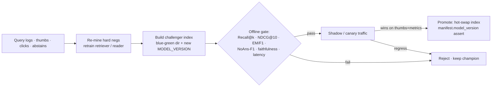

# Continual Learning & Monitoring

**Project #3 — `kbqa` (Knowledge Base QA, RAG-over-documents)** · Author: Le Dinh Minh Quan (23127460)
Assignment §8. Scope: how the deployed system collects new signal, retrains/refreshes its components, detects degradation, and is monitored in production. All component IDs, thresholds, and latency numbers below match the authoritative `docs/DESIGN_BRIEF.md`.

A RAG system is never "done at deploy". The corpus drifts (new docs land, old facts go stale), the query distribution shifts (new topics, new phrasings), and the retriever/reader that were strong on the launch eval set silently decay. This document defines the closed feedback loop: **collect → detect → retrain/refresh → re-index → champion/challenger promote**, plus the always-on monitoring that decides *when* to trigger it.

---

## 1. New-Data Collection

Every `/ask`, `/search`, and `/ingest` call already echoes `model_version` and (optionally) a full `trace`; the monitoring module persists a structured, privacy-scrubbed log row per request. These logs are the raw fuel for retraining.

| Signal | Source | Schema (logged fields) | Used for |
|---|---|---|---|
| **Query logs** | `/ask`, `/search` | `request_id, ts, question, rewritten_query, qtype, top_k, retrieved_chunk_ids[], rerank_scores[], answer, citations[], confidence, is_answerable, model_version, timing_ms` | Query-drift PSI, hard-negative re-mining, new-topic discovery |
| **Thumbs up/down** | UI / Gradio `feedback` widget → `POST /feedback` | `request_id, label∈{up,down}, freetext?, ts` | Champion/challenger labels, reader refresh targets |
| **Abstain cases** | `is_answerable:false` rows | `question, top_rerank_score, sufficiency.verdict, missing_terms[]` | Coverage gaps → corpus expansion; false-abstain mining |
| **Cited-passage clicks** | UI citation-marker clicks | `request_id, clicked_chunk_id, citation_marker, dwell_ms` | Weak-supervision relevance labels (clicked = positive) |
| **Reranker margins** | retrieve→rerank trace | `bm25_rank, dense_rank, rrf_rank, rerank_score` per candidate | Hard-negative pool (high BM25/dense rank, low rerank) |

**Weak labels, not gold.** Clicks and thumbs are noisy. We treat a clicked cited passage as a *soft positive* and a thumbs-down with a non-abstaining answer as a *faithfulness suspect* queued for human review, never as a direct training label. A small sampled slice (e.g. 1–2%) of `/ask` traffic is routed to manual annotation to keep a trusted, drift-aware gold set growing alongside the noisy logs.

**Privacy/PII.** Questions may contain user PII. The collection pipeline hashes `request_id`, runs a redaction pass before persistence, and retains raw text only inside the retention window; derived training pairs store chunk IDs and scrubbed query text.

---

## 2. Retraining & Fine-Tuning

Four assets refresh on different cadences. The §5 training recipe (H100) is reused verbatim — only the data and trigger change.

### 2.1 Retriever — re-mine hard negatives, then retrain

This directly extends §5.1/§5.6. The highest-leverage continual step is **re-mining hard negatives with the *current fine-tuned* retriever** (not the base model), because the negatives that fooled the deployed encoder are exactly the ones worth training against.

```
deployed bge-base-en-v1.5 (fine-tuned)
  └─ mine_hard_negatives(new_pairs, model=deployed, num_negatives=8,
       range_min=10, range_max=60, max_score=0.85, margin=0.05,
       sampling_strategy="top", use_faiss=True, output_format="n-tuple")
  └─ retrain  CachedMultipleNegativesRankingLoss(mini_batch_size=64),
       per_device_train_batch_size=256, epochs=3, lr=2e-5, bf16+tf32,
       BatchSamplers.NO_DUPLICATES,  metric_for_best_model="eval_cosine_ndcg@10"
  └─ 2-round loop: re-mine with the new checkpoint, retrain (lifts Recall@k)
```

New pairs come from (a) clicked cited passages as positives, (b) sampled-and-annotated query logs, and (c) the standing `sentence-transformers/natural-questions` / `Tevatron/msmarco-passage` data. **Switching or retraining the encoder forces a full index re-embed** (§2.4) — embeddings are not cross-compatible across model versions.

### 2.2 Reader — periodic refresh

`deepset/roberta-base-squad2` (extractive, null-score abstain) and the optional `google/flan-t5-base` generative reader refresh on a slower cadence (quarterly or on a detected EM/F1/NoAns-F1 drop), per §5.2/§5.3. Critically, per §5.6 we **train the reader on *retrieved* contexts, not gold contexts**, so the reader keeps matching the live retriever's output distribution. Thumbs-down + human-reviewed cases are folded in as additional hard examples (with `version_2_with_negative=True`, `bf16` only for FLAN-T5 — never fp16).

### 2.3 Index rebuild on corpus change

Any `/ingest` mutates the corpus. The store supports **incremental append-only** `add_with_ids` + tombstone deletes (§4.1), but HNSW cannot truly delete, so a **periodic offline `rebuild` compacts** the index, drops tombstoned vectors, and refreshes `manifest.json` (`model_version, dim, metric, n_vectors, built_at`). Re-embed is also mandatory whenever the encoder version changes (§2.1).

### 2.4 Champion/Challenger promotion

No retrained artifact ships directly. A **challenger** (new retriever / reader / index) is built into a parallel **blue/green index dir** (`/kb/v1`, `/kb/v2`) with its own `MODEL_VERSION`, then evaluated offline on the frozen eval set (§3) and online via shadow or small-percentage traffic with thumbs/click feedback.



Promotion requires the challenger to **beat the champion on the must-beat baseline plan (§6)** — fine-tuned + reranked over BM25 — without violating CPU latency targets (`/ask` extractive p50/p95 **350/800 ms**). On load, the API asserts `manifest.model_version == MODEL_VERSION` and refuses cross-version index reuse, giving a clean rollback (point the LB back at the previous dir).

---

## 3. Degradation Detection

Detection runs continuously against a **frozen evaluation set** (held-out gold qrels — `rag-mini-bioasq` gold `relevant_passage_ids` for retrieval recall, SQuAD-v2-derived gold contexts for reader EM/F1, plus a curated unanswerable slice). Because the eval set is frozen, any metric movement is a model/corpus regression, not measurement noise.

| Detector | Signal | Trigger condition | Likely cause |
|---|---|---|---|
| **Retrieval-recall drop** | Recall@{1,5,10}, NDCG@10, MRR@10 on frozen set | Recall@5 falls > 3 pts vs champion baseline | Encoder/index staleness, corpus shift |
| **Abstain-rate spike** | rolling `abstain_rate` from `/metrics` | > baseline + 2σ over a window | New topics with no coverage; retriever miss |
| **Faithfulness drop** | % cited-supported answers (entailment gate) | groundedness below floor | Reader hallucination, weak retrieval, stale chunks |
| **Embedding drift (PSI)** | PSI of live query-embedding distribution vs reference | PSI > 0.2 (moderate), > 0.25 (action) | Query-distribution shift |
| **Query drift (PSI)** | PSI on query length / qtype / topic-cluster mix | PSI > 0.2 | New phrasings, new intents |
| **Confidence calibration** | predicted `confidence` vs realized thumbs-up rate | reliability gap widens | Threshold drift around TAU_HIGH/TAU_LOW |

**PSI bands** (industry-standard): `< 0.1` stable, `0.1–0.2` minor, `> 0.2` significant shift → investigate, `> 0.25` → schedule retrain/re-embed. Embedding drift is computed on the *same* `BAAI/bge-base-en-v1.5` space used for retrieval, so it is free to compute from existing query vectors.

A simultaneous **abstain-rate spike + recall drop + query-PSI breach** is the canonical "new topic the corpus doesn't cover" signature → route to corpus expansion (ingest), not model retrain.

---

## 4. Monitoring Metrics (the monitoring module)

The project's monitoring module wraps `GET /metrics` (Prometheus text via `prometheus-fastapi-instrumentator`, plus `?format=json`). It exposes operational, quality, and drift metrics on one surface, every value tagged with `model_version` so dashboards can split champion vs challenger.

| Class | Metrics | Source |
|---|---|---|
| **Operational** | `requests_total`, `p50/p95_ask_ms`, `p95_search_ms`, `cache_hit_rate`, error rate, `index_n_vectors` | `/metrics` histograms (§4.2/§4.3) |
| **Quality (online)** | `abstain_rate`, thumbs-up rate, citation-click-through, mean `confidence` | feedback + trace logs |
| **Quality (offline, scheduled)** | Recall@k, NDCG@10, MRR@10, EM/F1, **HasAns-F1 / NoAns-F1**, faithfulness %, citation precision/recall | frozen eval job |
| **Drift** | query-embedding PSI, query-feature PSI, corpus-age histogram | monitoring module |

Latency SLOs to alert on (§4.3, CPU single replica): `/health` < 5 ms; `/search` (k=20, 50→8) 120/300 ms; `/ask` extractive **350/800 ms**; `/ask` FLAN-T5-base 0.9/2.0 s. A p95 breach is a paging alert; quality/drift breaches are ticket-level alerts that arm the retrain pipeline.

---

## 5. Drift Risks & Mitigation

| Drift risk | Symptom in monitoring | Mitigation |
|---|---|---|
| **Corpus staleness** (facts updated upstream; old chunks linger) | faithfulness drop, thumbs-down on "outdated" answers, rising corpus-age histogram | scheduled re-ingest of source-of-truth; tombstone + offline `rebuild` compaction; `ingested_at`/`hash` metadata enables stale-chunk eviction |
| **New topics** (questions about content not in the KB) | abstain-rate spike + recall drop + query-PSI breach | corpus expansion via `/ingest` (not retrain); abstain-case mining surfaces missing terms (`missing_terms[]`) for targeted document sourcing |
| **Query-distribution shift** (new phrasings, acronyms, intents) | query-feature + embedding PSI > 0.2 | re-mine hard negatives from recent logs and retrain retriever (§2.1); extend `analyze_query` thesaurus/acronym rules; refresh few-shot decomposition examples |
| **Reader drift** (extractive/generative quality decay vs live retrieval) | EM/F1 / NoAns-F1 drop on frozen set | periodic reader refresh trained on *retrieved* contexts (§2.2/§5.6) |
| **Threshold drift** (TAU_HIGH=0.55 / TAU_LOW=0.15 no longer well-calibrated) | calibration gap; abstain-rate moves without topic change | recalibrate sufficiency/confidence thresholds on a fresh dev slice; never tune on the frozen eval set |
| **Cross-version index reuse** (challenger index loaded against wrong encoder) | startup assertion failure | `manifest.model_version` assertion on load; blue/green dirs; mandatory re-embed on encoder swap |

**Guardrail:** the faithfulness entailment gate and extractive null-score abstention mean that *when in doubt, the system abstains* ("I don't have enough information in the knowledge base.") rather than fabricating. Drift therefore tends to surface first as a **rising abstain-rate** — a safe, observable failure mode — rather than as silent hallucination, which is exactly what the monitoring module is tuned to catch early.

---

## 6. Re-Embed / Index Strategy (summary)

1. **Corpus-only change** (docs added/removed, same encoder) → incremental `add_with_ids` + tombstone; periodic offline `rebuild` to compact; bump `n_vectors`/`built_at` in `manifest.json`.
2. **Encoder change** (retriever retrained/swapped) → **full re-embed mandatory**; build into a fresh blue/green dir with a new `MODEL_VERSION`; champion/challenger gate; hot-swap on promotion; assert manifest on load.
3. **Both** → encoder change dominates → full re-embed of the current corpus snapshot.

This keeps the deployed index, the encoder, the reranker (`cross-encoder/ms-marco-MiniLM-L-6-v2`), and the reader pinned together under one `MODEL_VERSION`, so the continual loop can advance the whole stack atomically and roll back cleanly.
