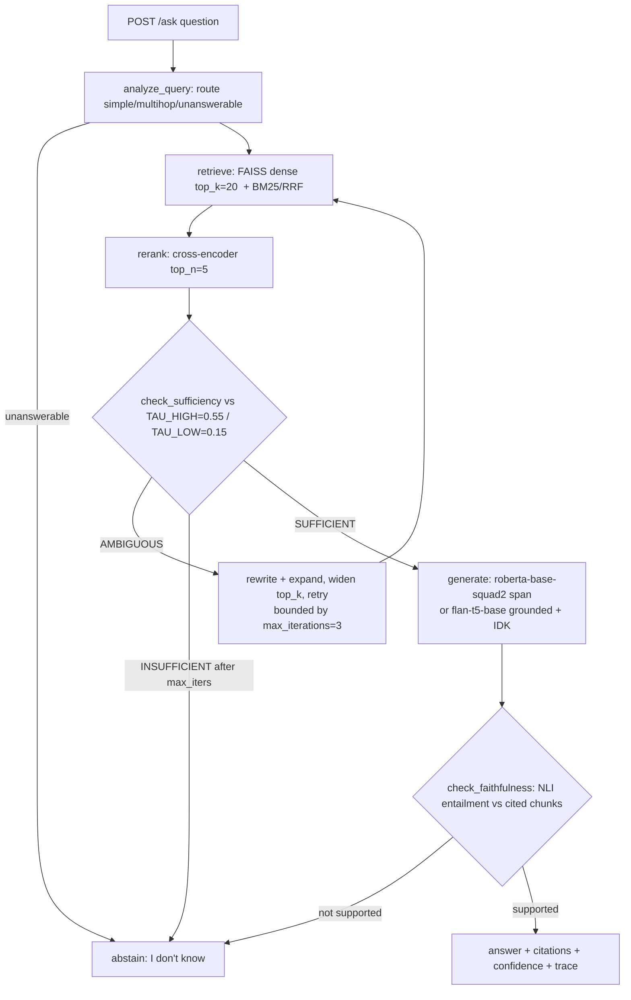

# Deployment Document

**Project #3 — Knowledge Base Question-Answering System (`kbqa`)**
**Author:** Le Dinh Minh Quan (23127460) · **Date:** 2026-06-26 · **Assignment §6: Deployment**

This document specifies how the agentic RAG-over-documents system is served, packaged, versioned, and operated. The system runs **on CPU by default** with **zero paid API**; GPU is an optional speed/accuracy knob. Every model id, threshold, and latency figure below matches the verified design brief.

---

## 1. Deployment Formats

The same in-process pipeline is exposed through four front-ends so the system fits notebooks, demos, scripts, and production traffic without code divergence. All four share one set of in-process model singletons and one FAISS index.

| Format | Surface | Primary use | Notes |
|---|---|---|---|
| **REST API** | FastAPI (`app.py`), port **8000** | Production / programmatic | `/health /ingest /search /ask /batch /metrics`; JSON I/O; Prometheus metrics |
| **Gradio UI** | `demo.py`, port **7860** | Human demo / grading | Calls `/ask`; shows answer + confidence + sources; renders abstention clearly |
| **CLI** | `python -m kbqa ask "..."` | Local scripting / debugging | Thin wrapper over the same pipeline functions; `--reader extractive|flan_t5`, `--top-k`, `--return-trace` |
| **Batch** | `POST /batch` + `python -m kbqa batch in.jsonl` | Offline evaluation / bulk QA | Bounded concurrency; one warm model load amortized over many questions |

All four call identical pipeline functions in `kbqa/` — there is one inference path, four entry points. This guarantees the demo, the CLI, and the eval harness exercise exactly what production serves.

---

## 2. Inference Pipeline for `/ask`

`/ask` runs the full deterministic agentic loop (CRAG correction + Self-RAG reflection + query rewrite/decompose). Models are pinned together by the `MODEL_VERSION` env var and held in in-process singletons plus LRU caches.



**Stage map (extractive default):**

1. **analyze_query** — rule-based route (multi-hop cues, coreference, >1 NER). Unanswerable type ⇒ immediate abstain.
2. **retrieve** — embed query with `BAAI/bge-base-en-v1.5` (query prefix `"Represent this sentence for searching relevant passages: "`), FAISS ANN top-k=20, optional `rank_bm25` fused by RRF.
3. **rerank** — `cross-encoder/ms-marco-MiniLM-L-6-v2` reranks top-50 → top-5, sets `rerank_score`.
4. **check_sufficiency** — top rerank ≥ `TAU_HIGH` (0.55) ⇒ SUFFICIENT; `[TAU_LOW, TAU_HIGH)` ⇒ AMBIGUOUS (rewrite + expand, retry, bounded by `max_iterations=3`); `< TAU_LOW` (0.15) ⇒ INSUFFICIENT.
5. **generate** — extractive `deepset/roberta-base-squad2` (span + source chunk, **null-score abstain**) or grounded `google/flan-t5-base` ("answer using ONLY context; cite [chunk_id]").
6. **check_faithfulness** — entailment between concatenated cited chunks (premise) and answer (hypothesis); if not supported ⇒ **abstain**. A final global gate runs on the synthesized multi-hop answer.

**Confidence** = calibrated blend of top `rerank_score` + reader span/sequence probability + groundedness check. **Abstain trigger:** top rerank `< τ` **or** extractive null-score wins ⇒ `is_answerable: false`, answer `"I don't have enough information in the knowledge base."`

---

## 3. Endpoint Table with I/O JSON

| Method | Path | Purpose |
|---|---|---|
| GET | `/health` | Liveness + index/model status |
| POST | `/ingest` | Chunk → embed → index documents |
| POST | `/search` | Retrieve + rerank passages |
| POST | `/ask` | Full agentic RAG answer + citations |
| POST | `/batch` | Many `/ask` requests, bounded concurrency |
| GET | `/metrics` | Prometheus text + JSON summary |

### `GET /health`
```json
{ "status": "ok", "model_version": "kbqa-2026.06-bge-roberta",
  "index": { "loaded": true, "n_vectors": 3200, "metric": "ip" }, "uptime_s": 4821 }
```

### `POST /ingest`
Request:
```json
{ "documents": [ { "doc_id": "d1", "title": "SpaceX", "text": "...", "source": "spacex.md", "metadata": {} } ],
  "chunking": { "size": 512, "overlap": 64 }, "upsert": true }
```
Response:
```json
{ "ingested_docs": 1, "new_chunks": 14, "skipped_duplicate_chunks": 2,
  "index_n_vectors": 3214, "model_version": "kbqa-2026.06-bge-roberta", "took_ms": 41 }
```
SHA-256 dedup on normalized chunk text makes re-ingest idempotent (`skipped_duplicate_chunks`).

### `POST /search`
Request:
```json
{ "query": "Who founded SpaceX?", "top_k": 20, "rerank_top_n": 8, "filters": {}, "min_score": 0.0 }
```
Response:
```json
{ "passages": [ { "chunk_id": "spacex.md#c12", "doc_id": "d1", "title": "SpaceX",
    "text": "SpaceX was founded in 2002 by Elon Musk...", "source": "spacex.md",
    "offset": [120, 480], "retriever_score": 0.74, "rerank_score": 0.71, "rank": 1 } ],
  "timing_ms": { "embed": 18, "ann": 6, "rerank": 92, "total": 118 },
  "model_version": "kbqa-2026.06-bge-roberta" }
```

### `POST /ask`
Request:
```json
{ "question": "Which university did the founder of SpaceX attend, and when was it established?",
  "top_k": 20, "rerank_top_n": 5, "reader": "extractive",
  "max_new_tokens": 256, "require_citations": true, "return_trace": false }
```
Answerable response:
```json
{ "answer": "Elon Musk, the founder of SpaceX, attended the University of Pennsylvania, established in 1740.",
  "citations": [ { "marker": "[1]", "chunk_id": "bio.md#c07", "doc_id": "d2", "source": "bio.md",
                   "quote": "Elon Musk transferred to the University of Pennsylvania", "offset": [40, 96] } ],
  "confidence": 0.90, "is_answerable": true,
  "trace": { "steps": [], "model_version": "kbqa-2026.06-bge-roberta" },
  "timing_ms": { "retrieve": 118, "read": 410, "total": 560 } }
```
Abstention response:
```json
{ "answer": "I don't have enough information in the knowledge base.",
  "citations": [], "confidence": 0.08, "is_answerable": false,
  "trace": { "steps": [], "model_version": "kbqa-2026.06-bge-roberta" },
  "timing_ms": { "total": 372 } }
```

### `POST /batch`
Request: `{ "requests": [ { "question": "..." }, { "question": "..." } ], "reader": "extractive", "max_concurrency": 4 }`
Response: `{ "results": [ /* /ask objects */ ], "count": 2, "took_ms": 980, "model_version": "kbqa-2026.06-bge-roberta" }`

### `GET /metrics`
Prometheus text via `prometheus-fastapi-instrumentator`; `?format=json` returns:
```json
{ "requests_total": 10432, "p50_ask_ms": 540, "p95_ask_ms": 790, "cache_hit_rate": 0.37,
  "index_n_vectors": 3214, "abstain_rate": 0.18, "model_version": "kbqa-2026.06-bge-roberta" }
```

---

## 4. FAISS Persistence, Manifest, and Blue/Green Index

**Build.** L2-normalize embeddings so cosine == inner product → `IndexFlatIP` for `< 100k` chunks, `IndexHNSWFlat(d, M=32)` for `≥ 100k`, wrapped in `IndexIDMap2` so FAISS ids equal chunk row ids.

**Persist.** Three artifacts per index version:
- `kb.index` — `faiss.write_index(index, "kb.index")`
- `meta.parquet` — id → text + metadata sidecar
- `manifest.json` — `{ model_version, dim, metric, n_vectors, built_at }`

**Load with version assertion.** `faiss.read_index(...)`, then **assert `manifest.model_version == MODEL_VERSION`**. Embeddings from different encoders are not cross-compatible, so a mismatch refuses to load rather than silently degrading recall.

**Incremental ingest.** Append-only `add_with_ids`; mirror rows to `meta.parquet`; deletes via a tombstone set + `IDSelectorBatch` at query time (HNSW adds but cannot delete). Periodic offline `rebuild` compacts (mark-and-rebuild).

**Blue/green index.** Two index directories `/kb/v1` and `/kb/v2`. Writes funnel to a single ingest worker that builds the new version; replicas hot-swap the active pointer after the manifest assertion passes — zero-downtime re-index on any encoder swap.

```
ingest worker → build /kb/v2 → verify manifest.model_version → flip ACTIVE → replicas mmap /kb/v2
```

---

## 5. User Interaction Examples

**curl — /ask:**
```bash
curl -s http://localhost:8000/ask \
  -H "Content-Type: application/json" \
  -d '{"question":"Who founded SpaceX?","reader":"extractive","top_k":20}'
```

**curl — /ingest:**
```bash
curl -s http://localhost:8000/ingest -H "Content-Type: application/json" \
  -d '{"documents":[{"doc_id":"d1","title":"SpaceX","text":"SpaceX was founded in 2002 by Elon Musk.","source":"spacex.md"}],"chunking":{"size":512,"overlap":64},"upsert":true}'
```

**CLI:**
```bash
python -m kbqa ask "When was the University of Pennsylvania established?" --return-trace
```

**Gradio.** Launch `python demo.py` (port 7860). The user types a question; the UI calls `/ask` and renders: the answer, a confidence bar, and an expandable **Sources** panel listing each cited `chunk_id`, source file, and quoted span. On abstention it shows the plain `"I don't have enough information in the knowledge base."` message with no fabricated citations, so graders can see the safety behavior directly.

---

## 6. Latency Targets (CPU, single replica)

| Endpoint | p50 / p95 | Lever |
|---|---|---|
| `/health` | < 5 ms | no model call |
| `/search` (k=20, 50→8) | 120 / 300 ms | batched encode, ONNX int8 bi-encoder, HNSW |
| `/ask` (extractive) | 350 / 800 ms | reuse `/search` + 1 reader pass |
| `/ask` (FLAN-T5-base) | 0.9 / 2.0 s | `max_new_tokens=256`, no bf16 on CPU |
| `/ingest` (per 1k chunks) | ~3–6 s | batched encode (batch 64), async |

---

## 7. Scalability and Model Versioning

**Scalability levers:**
- **Singletons** — encoder, reranker, and reader loaded once per process; no per-request model construction.
- **Batched encode** — ingest and search embed in batches of 64.
- **HNSW** — `IndexHNSWFlat(M=32)` ANN for ≥ 100k chunks keeps search sub-linear.
- **ONNX int8** — dynamic int8 quantization of bi-encoder and cross-encoder via ONNX Runtime (2–4× CPU speedup).
- **LRU cache** — query-embedding LRU cache short-circuits repeated questions.
- **Stateless replicas** — API replicas are stateless behind a load balancer; the FAISS index + `meta.parquet` sit on a shared read-only mmap volume (or per-replica copy). Tune `OMP_NUM_THREADS` (default 4); rerank only the top-50.

**Write path:** a single ingest worker builds and publishes a new index version; stateless replicas hot-swap via blue/green dirs.

**Model versioning.** `MODEL_VERSION` pins encoder + reranker + reader + index together. It is echoed in **every response** and in `/metrics`, asserted against `manifest.model_version` on index load, and drives blue/green swaps. Changing any model component bumps `MODEL_VERSION` and forces a re-index — there is no partial-version state.

---

## 8. Docker and Hugging Face Space

**Docker.** Base `python:3.11-slim`:
```dockerfile
FROM python:3.11-slim
RUN pip install fastapi "uvicorn[standard]" gradio \
    sentence-transformers==5.6.0 faiss-cpu pandas pyarrow \
    prometheus-fastapi-instrumentator onnxruntime
COPY . /app
WORKDIR /app
ENV MODEL_VERSION=kbqa-2026.06-bge-roberta OMP_NUM_THREADS=4
EXPOSE 7860 8000
CMD ["bash", "-lc", "uvicorn app:app --host 0.0.0.0 --port 8000 & python demo.py"]
```
Steps: `docker build -t kbqa .` → `docker run -p 8000:8000 -p 7860:7860 kbqa`. The `kb/{kb.index,meta.parquet,manifest.json}` artifacts are copied in or built at startup.

**HF Space.** SDK = `docker`, app exposed on port **7860**. The FAISS index ships via Git LFS or is built at startup from a dataset repo; `MODEL_VERSION` is set as a Space variable so the same manifest assertion runs in the Space. `model_versions` are echoed in responses for reproducibility on the grader's side.

---

## 9. Deployment Challenges and Limitations

| Challenge | Impact | Mitigation |
|---|---|---|
| **Cross-version index reuse** | Loading an index built by a different encoder silently destroys recall (embeddings are not cross-compatible). | `manifest.model_version` assertion on load refuses mismatched indexes; blue/green dirs + forced re-index on any encoder swap. |
| **Cold start** | First request after boot pays model download + load + ONNX session init (seconds). | Singletons warmed at startup (a synthetic warm-up query); persist ONNX sessions; keep the demo KB index small (`rag-mini-wikipedia`, 3,200 passages) for fast Space boot. |
| **Abstain UX** | Users may read `"I don't know"` as a failure rather than a safety guarantee. | Gradio surfaces abstention explicitly with confidence and the reason (no sufficient/faithful evidence), never fabricated citations; `is_answerable:false` is machine-readable for downstream callers. |
| **CPU-only latency ceiling** | Generative `/ask` (FLAN-T5) can reach ~2 s p95. | ONNX int8, HNSW, top-50 rerank cap, LRU cache; heavier `bge-reranker-v2-m3` / `deberta-v3-large-squad2` / `flan-t5-large` stay behind GPU config flags. |
| **Single-writer ingest** | All writes serialize through one worker. | Acceptable for KB-scale corpora; horizontal read scaling via stateless replicas; periodic offline rebuild compacts tombstoned deletes. |
| **HNSW delete limitation** | HNSW cannot delete vectors in place. | Query-time tombstone `IDSelectorBatch` + scheduled mark-and-rebuild compaction. |

---

*All dataset ids, model ids, thresholds (TAU_HIGH=0.55, TAU_LOW=0.15), `max_iterations=3`, and latency figures in this document are consistent with the verified design brief (`docs/DESIGN_BRIEF.md`).*
