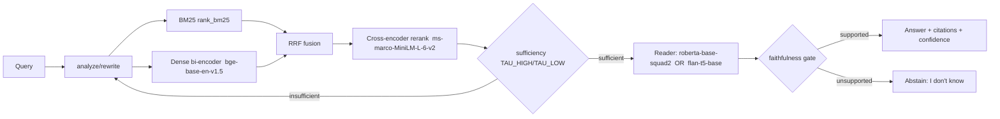

# Model Selection & Optimization

> Project #3 — Knowledge Base Question-Answering System (`kbqa`). Author: Le Dinh Minh Quan (23127460).
> Assignment §5. All model IDs, datasets, hyperparameters, and thresholds below are drawn from the verified `DESIGN_BRIEF.md`. Projected numbers are explicitly labelled.

This document specifies every learnable component of the RAG-over-documents pipeline, justifies each choice against a concrete business need, and lays out the training, tuning, baseline, and error-analysis plan. The system is **CPU-default, zero-paid-API**: every model below either runs acceptably on CPU or is gated behind an explicit GPU config flag.

---

## 1. Component Architecture Overview

The answer path is a six-stage chain, each stage backed by a deliberately chosen model. The agent state machine (CRAG loop + Self-RAG reflection) wraps this chain but does not change the per-component model selection.

| Stage | Component | Model (default) | Params | License | Role |
|---|---|---|---|---|---|
| Retrieve (sparse) | BM25 baseline | `rank_bm25` (BM25Okapi) | — | — (pip) | exact-term / rare-entity recall |
| Retrieve (dense) | Bi-encoder | `BAAI/bge-base-en-v1.5` | 109.5M | MIT | semantic recall |
| Fuse | RRF hybrid | Reciprocal Rank Fusion | — | — | combine sparse+dense ranks |
| Rerank | Cross-encoder | `cross-encoder/ms-marco-MiniLM-L-6-v2` | 22.7M | Apache-2.0 | precision@k, top-50→top-5 |
| Read (extractive) | Span QA + null-score | `deepset/roberta-base-squad2` | ~125M | CC-BY-4.0 | grounded span + abstain |
| Read (generative) | Seq2seq grounded | `google/flan-t5-base` | 247.6M | Apache-2.0 | fluent grounded + IDK |

---

## 2. Per-Component Architecture & Business Justification

### 2.1 Dense bi-encoder retriever — `BAAI/bge-base-en-v1.5`
**Architecture.** A BERT-base dual-encoder (109.5M params, 768-d). Query and passage are encoded independently into a shared embedding space; relevance is the dot product of L2-normalized vectors (equivalent to cosine). This is what makes it scale: passages are embedded **once at ingest** into FAISS; query time is a single forward pass + ANN lookup. A critical operational detail — bge requires the prefix `"Represent this sentence for searching relevant passages: "` on **queries only**; passages are embedded raw. Getting this wrong silently degrades recall.

**Business need.** Production knowledge bases ask paraphrased, natural-language questions ("how do I reset my password") that rarely share surface tokens with the source document ("credential recovery procedure"). A dense bi-encoder captures this semantic match where lexical search fails. **MIT licence** makes it the most permissive strong retriever — no commercial-use friction. CPU fallback `all-MiniLM-L6-v2` (22.7M, 384-d) gives ¼ the index size and ~4–5× faster CPU encode when latency dominates accuracy.

### 2.2 BM25 sparse baseline — `rank_bm25`
**Architecture.** Bag-of-words probabilistic ranking (BM25Okapi): TF saturation + IDF + length normalization over a tokenized corpus. Pure-Python, no GPU, no model download.

**Business need.** Dense retrievers systematically miss **exact identifiers** — product SKUs, error codes, function names, proper nouns unseen in pretraining. BM25 nails these. It is also the honest floor every learned component must beat (see §5).

### 2.3 RRF hybrid fusion
**Architecture.** Reciprocal Rank Fusion combines the BM25 ranking and the dense ranking by summing `1/(k + rank)` per document across both lists — rank-based, so it needs no score calibration between incomparable scoring schemes.

**Business need.** Hybrid reliably beats either retriever alone on rare-entity and out-of-distribution queries, at near-zero cost. RRF is applied to the union of both top-lists **before** reranking.

### 2.4 Cross-encoder reranker — `cross-encoder/ms-marco-MiniLM-L-6-v2`
**Architecture.** A 22.7M MiniLM that takes **(query, passage) jointly** and emits a single relevance score with full cross-attention between the two. Far more accurate than a bi-encoder but O(k) forward passes — hence used only to re-score the candidate top-50 down to top-5, in single-digit ms/pair on CPU.

**Business need.** Reranking is the **highest-ROI accuracy lever in RAG**: it fixes the bi-encoder's near-misses and directly determines which passages the reader sees. The GPU upgrade `BAAI/bge-reranker-v2-m3` (567.8M, ~25× CPU cost) is a config swap for offline/GPU accuracy-max runs.

### 2.5 Extractive reader — `deepset/roberta-base-squad2` (null-score abstain)
**Architecture.** RoBERTa-base (~125M) with a span head producing start/end logits over context tokens, plus a **null/`[CLS]` score**. The answer is the best (start, end) span; if `null_score − best_span_score > threshold`, the model **abstains**. This is the literal "I don't know" mechanism, learned from SQuAD v2's ~50K unanswerable questions.

**Business need.** The single most important production property is **not hallucinating**. An extractive reader can only return a span that physically exists in a retrieved passage, so every answer is by construction grounded and trivially citable (the source chunk + character offsets). The null-score head makes "no answer in the KB" a first-class, calibrated output rather than a fabrication. CC-BY-4.0 requires attribution in the product/docs.

### 2.6 Generative grounded reader — `google/flan-t5-base`
**Architecture.** A 247.6M encoder-decoder (seq2seq) instruction-tuned model. Prompted with a strict grounding template, it generates a fluent answer constrained to the retrieved context, or emits "I don't know."

**Business need.** Extractive spans cannot **synthesize** across passages or rephrase for readability — multi-hop and aggregation questions need generation. FLAN-T5-base is Apache-2.0, CPU-runnable, and trainable on a single H100. The faithfulness gate (NLI/overlap entailment) backstops its tendency to drift from context. `flan-t5-large` (783.2M) is the fluency upgrade; `Qwen2.5-1.5B-Instruct` the optional no-train abstractive option.

---

## 3. Training Procedure

Three independently trainable stages. Target hardware: H100 80GB (TF32 on, bf16 compute). All stages are resume-safe (`trainer.train(resume_from_checkpoint=True)`, `save_total_limit=3`). Stack: `sentence-transformers==5.6.0`, `transformers>=4.44`.

### 3.1 Retriever — MNRL + hard-negative mining
1. **Mine hard negatives** with `mine_hard_negatives(..., num_negatives=8, range_min=10, range_max=60, max_score=0.85, margin=0.05, sampling_strategy="top", use_faiss=True, output_format="n-tuple")`. The `range_min` / `max_score` / `margin` guards suppress false negatives (true positives masquerading as negatives).
2. **Train** with `CachedMultipleNegativesRankingLoss(mini_batch_size=64)` to reach an **effective batch of 256–1024** on H100 without OOM. Large batch ⇒ many in-batch negatives ⇒ stronger contrastive signal. Key args: `per_device_train_batch_size=256`, `num_train_epochs=3`, `lr=2e-5`, `warmup_ratio=0.1`, cosine schedule, **`bf16=True`, `tf32=True`**, `BatchSamplers.NO_DUPLICATES`, `weight_decay=0.01`, `metric_for_best_model="eval_cosine_ndcg@10"`.
3. **Iterate**: after round 1, **re-mine hard negatives with the fine-tuned model** and retrain (2 rounds) — this lifts Recall@k notably.
4. Datasets: start on `sentence-transformers/natural-questions` (`pair`, 100,231); scale to `sentence-transformers/msmarco` triplets (licence-flagged). Zero-download fallback: SQuAD v2 answerable `(question, context)` pairs.

### 3.2 Extractive reader — SQuAD2, doc_stride, no-answer threshold
- **Preprocess**: `MAX_LEN=384`, `DOC_STRIDE=128`, `truncation="only_second"`, `return_overflowing_tokens=True`, `return_offsets_mapping=True`. Sliding window over long contexts. **Empty `answer_start` (unanswerable) ⇒ point start/end to `[CLS]`**; out-of-window spans → `[CLS]` too.
- **Train** `deepset/roberta-base-squad2`: `num_train_epochs=2`, `lr=3e-5`, `warmup_ratio=0.1`, `per_device_train_batch_size=48`, **`bf16=True`, `tf32=True`**, `weight_decay=0.01`, `metric_for_best_model="f1"`.
- **Score**: `evaluate.load("squad_v2")` with `version_2_with_negative=True`; tune the no-answer `threshold` on dev. Report EM / F1 plus **HasAns-F1 / NoAns-F1** separately.

### 3.3 FLAN-T5 generative reader — bf16-only grounded prompt
- Prompt: *"Answer the question using ONLY the context. If the answer is not in the context, say 'I don't know.'"* with `(question, context)`; input `max_length=1024`, target 128.
- `Seq2SeqTrainingArguments`: `num_train_epochs=3`, `lr=1e-4`, `per_device_train_batch_size=16`, `gradient_accumulation_steps=2`, **`bf16=True` — never `fp16` (FLAN-T5 NaNs under fp16)**, `tf32=True`, `weight_decay=0.01`, `label_smoothing_factor=0.1`, **`predict_with_generate=True`**, `generation_max_length=128`.
- Fine-tune set: `neural-bridge/rag-dataset-12000` (Apache-2.0).

### 3.4 Anti-overfitting & closing the train/serve gap
`weight_decay=0.01`, 10% warmup, cosine/linear decay, `EarlyStoppingCallback(patience=3)` + `load_best_model_at_end`; retriever uses `NO_DUPLICATES` + curated hard negatives at 2–3 epochs; reader 2 epochs + label smoothing. A true dev set is held out of mining. Crucially, **train the reader on retrieved (not gold) contexts** so it sees the imperfect passages it will face at serve time.

---

## 4. Hyperparameter Tuning Plan

| Component | Hyperparameter | Search range | Selection metric |
|---|---|---|---|
| Retriever | learning rate | {1e-5, 2e-5, 3e-5} | `eval_cosine_ndcg@10` |
| Retriever | effective batch | {256, 512, 1024} | NDCG@10 / Recall@5 |
| Retriever | `num_negatives` (mining) | {4, 8, 16} | Recall@5 after re-mine |
| RRF | fusion constant `k` | {20, 60, 100} | Recall@5 on dev qrels |
| Reranker | top-k fed in / top-n out | k∈{20,50}, n∈{3,5,8} | NDCG@10 vs latency |
| Extractive reader | no-answer `threshold` | swept on dev | NoAns-F1 vs HasAns-F1 balance |
| Extractive reader | learning rate | {2e-5, 3e-5} | F1 |
| FLAN-T5 | learning rate | {5e-5, 1e-4} | F1 + faithfulness |
| Agent | `TAU_HIGH` / `TAU_LOW` | start 0.55 / 0.15 | abstain-rate vs F1 trade-off |
| Agent | `max_iterations` | {2, 3, 4} | multi-hop F1 vs latency |

The agent thresholds (`TAU_HIGH=0.55`, `TAU_LOW=0.15`) and the reader no-answer threshold are tuned **jointly against the abstention objective**: too aggressive and the system says "I don't know" to answerable questions; too lax and it hallucinates. These are calibrated on a dev split with both answerable and unanswerable questions.

---

## 5. Baseline Comparison Plan

Establish an honest floor before any fine-tuning; every learned component must beat it.

**Retrieval ladder.** BM25 (`rank_bm25`) → zero-shot `bge-base-en-v1.5` → hybrid RRF → **fine-tuned retriever** → **fine-tuned + reranked**. Metrics: Recall@{1,5,10}, NDCG@10, MRR@10 on gold qrels (`rag-mini-bioasq` `relevant_passage_ids`, or SQuAD-derived gold contexts).

**Reader ladder.** Zero-shot `roberta-base-squad2` vs fine-tuned (EM/F1 + NoAns-F1); FLAN-T5-base zero-shot vs fine-tuned (EM/F1 + faithfulness).

**End-to-end.** Floor = BM25 + zero-shot reader, no rerank, no agent loop. Full stack = hybrid retrieve → rerank → fine-tuned reader → agent loop; must improve EM/F1, faithfulness, and citation accuracy while staying within CPU latency targets.

### 5.1 Example projected results — *PROJECTED, NOT YET MEASURED*

> The numbers below are **illustrative targets** to frame the expected lift, not measured results.

**Retrieval (PROJECTED)**

| System | Recall@1 | Recall@5 | NDCG@10 | MRR@10 |
|---|---|---|---|---|
| BM25 (sparse only) | ~0.32 | ~0.55 | ~0.50 | ~0.45 |
| Zero-shot dense (bge) | ~0.40 | ~0.66 | ~0.61 | ~0.55 |
| Hybrid RRF (zero-shot) | ~0.46 | ~0.72 | ~0.67 | ~0.61 |
| Fine-tuned dense + RRF | ~0.55 | ~0.79 | ~0.74 | ~0.69 |
| **+ cross-encoder rerank** | **~0.61** | **~0.82** | **~0.79** | **~0.74** |

**Reader (PROJECTED)**

| System | EM | F1 | NoAns-F1 |
|---|---|---|---|
| Zero-shot roberta-base-squad2 | ~0.62 | ~0.69 | ~0.68 |
| **Fine-tuned roberta-base-squad2** | **~0.70** | **~0.78** | **~0.76** |
| FLAN-T5-base (grounded, fine-tuned) | ~0.66 | ~0.74 | n/a (IDK rate tracked) |

Expected headline lift: retrieval Recall@5 **~0.55 → ~0.82** (BM25 → fine-tuned + rerank); reader **EM ~0.70 / F1 ~0.78** after fine-tuning.

---

## 6. Error Analysis Plan

| Error class | Symptom | Diagnosis / mitigation |
|---|---|---|
| **Retrieval miss** | Gold passage absent from top-k ⇒ reader cannot answer | Inspect BM25 vs dense recall split; rare-entity misses → strengthen BM25/RRF weighting; semantic misses → re-mine hard negatives; raise top-k before rerank |
| **Reranker demotion** | Gold passage retrieved but ranked below cutoff | Tune top-k in / top-n out; check (query, passage) length truncation |
| **Multi-hop failure** | First hop correct, dependent hop unfilled or wrong | Verify decomposition cues fired; inspect `depends_on` slot-filling; widen top_k per CRAG retry; bound by `max_iterations=3` |
| **Abstention error (false abstain)** | Answerable question → "I don't know" | No-answer threshold / `TAU_LOW` too high; sufficiency gate too strict — recalibrate on dev |
| **Abstention error (false answer)** | Unanswerable question → fabricated span/text | Null-score threshold / `TAU_HIGH` too low; tighten faithfulness gate |
| **Faithfulness failure** | Fluent answer not entailed by cited context | NLI/overlap entailment gate drops it → abstain; common for generative reader — check grounding prompt adherence |
| **Citation error** | Right answer, wrong/missing `chunk_id` | Audit `[i]`→chunk_id mapping; enforce `require_citations` |

Every decision is logged to `state.trace`, so each failure is attributable to a specific node — retrieval, rerank, sufficiency, generation, or faithfulness.

---

## 7. Trade-offs

**Accuracy vs latency.** Reranking and hybrid retrieval add the most accuracy but also the most CPU cost. We cap rerank at the top-50 candidates, offer ONNX int8 quantization (2–4×) on the bi-encoder and cross-encoder, and keep `bge-reranker-v2-m3` / `deberta-v3-large` / `flan-t5-large` behind GPU flags. CPU `/ask` (extractive) targets ~350/800 ms p50/p95.

**Extractive vs generative reader.** Extractive (`roberta-base-squad2`) is faster, trivially grounded, trivially citable, and abstains via null-score — the safe default. Generative (`flan-t5-base`) reads more naturally and synthesizes across passages, at the cost of a hallucination surface that the faithfulness gate must police. The system ships both and routes by query type; extractive is default for single-hop factoids, generative for multi-hop synthesis.

**Complexity vs maintainability.** Each added model (reranker, second reader, optional LLM brain, pluggable `kg_query`) increases moving parts and the version-pinning surface. We contain this with a single `MODEL_VERSION` that pins encoder + reranker + reader + index together, a `manifest.model_version` assertion on index load (embeddings are not cross-compatible across encoders), and `trust_remote_code` models (`gte-base-en-v1.5`) avoided by default. Every component has a no-LLM, no-GPU default path, so the baseline system is fully reproducible on a laptop.
