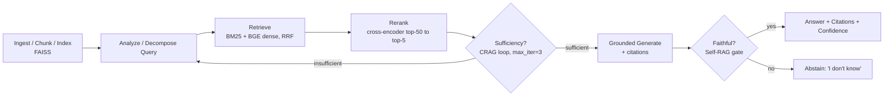
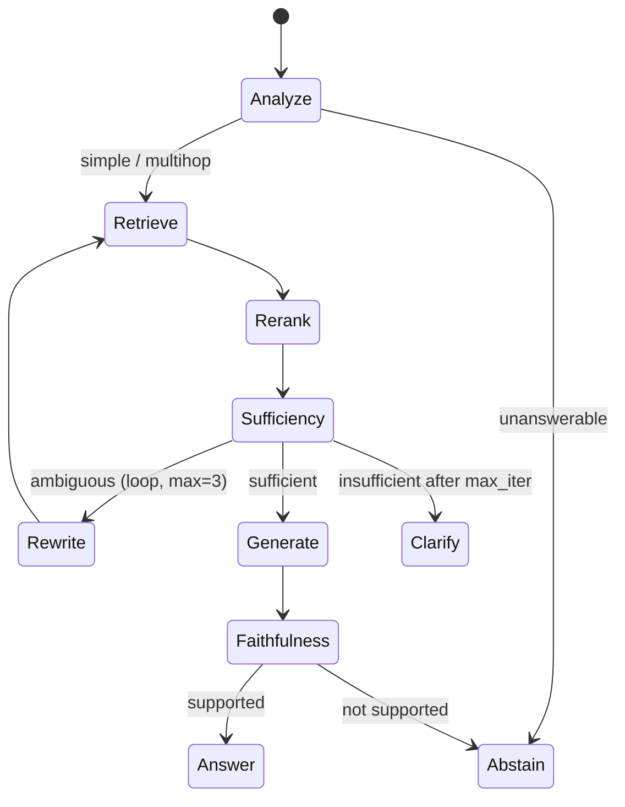

# Presentation Slide Deck Outline

**Project #3 — Knowledge Base Question-Answering System (`kbqa`)**
Author: Le Dinh Minh Quan (23127460) · NLP-in-Industry Final Assignment

A 12-slide deck mapping 1:1 to the written report. Each slide lists a title, 3–5 speaker bullets, and a visual/diagram note. Target talk length ~12–15 minutes (≈1 min/slide + Q&A). All numbers below match the authoritative `DESIGN_BRIEF.md`.

---

## Slide 1 — Title & Project Info

- **Title:** "Knowledge Base QA: Agentic RAG-over-Documents with Grounded, Cited Answers."
- Author: Le Dinh Minh Quan (23127460); course / NLP-in-Industry final assignment; package name `kbqa`.
- One-line thesis: *answer from your documents with citations and confidence — or say "I don't know."*
- Headline constraints badge: **CPU-default, zero paid API, open-source models only.**

**Visual:** Clean title slide; small architecture thumbnail bottom-right; a 3-chip strip "Grounded · Cited · Abstains."

---

## Slide 2 — Business Problem & Motivation

- Enterprise knowledge lives in **PDFs, wikis, tickets** — not curated databases; staff waste time hunting for answers across documents.
- Plain LLMs **hallucinate** and give no provenance — unacceptable for compliance, support, and internal knowledge use.
- Business need: trustworthy answers that **cite the source span** and **abstain** when the corpus lacks support, deployable cheaply (CPU, no per-token API cost).
- Success criteria: high answer F1 *and* faithfulness, auditable citations, safe abstention on unanswerable questions, sub-second CPU latency.

**Visual:** Two-panel "before vs after" — left: user + scattered docs + a confidently-wrong LLM; right: `kbqa` returning answer + `[cite]` + confidence.

---

## Slide 3 — Proposed RAG Solution (vs Plain LLM / vs ChatKBQA)

- **Plain LLM:** fluent but ungrounded, stale, no citations → hallucination risk; rejected as the answer engine.
- **ChatKBQA (semantic parsing over Freebase):** accurate & auditable (WebQSP F1 79.8 / Hits@1 83.2) but needs a ~50 GB Freebase dump in Virtuoso (100 GB+ RAM), GPU, and **per-schema fine-tuning** → operationally impractical for general docs.
- **Our choice — RAG-over-documents:** drop in docs → re-embed (no labels), CPU-default, citations to source spans, safe abstention; semantic parsing kept as a **pluggable `kg_query` backend** for customers with a real KG.
- Net: we trade a few points of multi-hop precision for deployability, generality, and provenance — recovered via the agent loop.

**Visual:** 3-column comparison table (Plain LLM / ChatKBQA / RAG-over-docs) across rows: grounding, citations, new-domain cost, hardware, abstention.

| Criterion | Plain LLM | ChatKBQA | **RAG-over-docs (ours)** |
|---|---|---|---|
| Grounded + citations | No | Yes (SPARQL) | **Yes (source spans)** |
| New domain cost | Prompt only | Per-schema fine-tune | **Drop in docs, re-embed** |
| Hardware | GPU/API | GPU + 100 GB+ RAM | **CPU-default** |
| Abstains | Weak | N/A | **Yes ("I don't know")** |

---

## Slide 4 — System Architecture Diagram

- End-to-end pipeline: ingest/chunk/index → analyze query → retrieve → rerank → sufficiency check → grounded generate → faithfulness check → answer **or** abstain.
- Hybrid retrieval: **BM25 (`rank_bm25`) ⊕ BGE dense, fused via RRF**, then cross-encoder rerank top-50 → top-5.
- Two decision gates produce the safety behavior: **sufficiency** (CRAG loop) and **faithfulness** (Self-RAG gate → abstain).
- Every stage runs on CPU by default; GPU is a speed/accuracy knob, not a requirement.

**Visual:** The core left-to-right pipeline diagram (mermaid below).

---

## Slide 5 — Data Overview

- **Reader:** `rajpurkar/squad_v2` (CC-BY-SA-4.0) — ~50K **unanswerable** questions are the key asset for abstention; `hotpotqa/hotpot_qa` (distractor) for multi-hop evaluation.
- **Retriever pairs:** `sentence-transformers/natural-questions` (CC-BY-SA-3.0) for the bi-encoder fine-tune.
- **Demo / eval KB:** `rag-datasets/rag-mini-wikipedia` (CC-BY-3.0, 3,200 passages / 918 QA); `rag-mini-bioasq` provides **gold passage IDs** for retrieval-recall; `neural-bridge/rag-dataset-12000` (Apache-2.0) for generative-RAG.
- Governance: every ID verified live on HF Hub; licenses tracked; no large data committed (download-on-demand). `trivia_qa` / MS MARCO flagged ⚠️ for legal before commercial use.

**Visual:** Data table grouped by role (Reader / Retriever / Demo-KB) with columns ID · rows · license · purpose.

| Role | Dataset | Size | License |
|---|---|---|---|
| Reader + abstain | `rajpurkar/squad_v2` | 130K train / 11.9K val | CC-BY-SA-4.0 |
| Multi-hop eval | `hotpotqa/hotpot_qa` | 90K train | CC-BY-SA-4.0 |
| Retriever pairs | `sentence-transformers/natural-questions` | 100K pairs | CC-BY-SA-3.0 |
| Demo KB | `rag-datasets/rag-mini-wikipedia` | 3,200 / 918 QA | CC-BY-3.0 |
| Retrieval recall | `rag-datasets/rag-mini-bioasq` | gold passage IDs | CC-BY-2.5 |

---

## Slide 6 — Models & Evaluation Results (Retrieval + Reader + Faithfulness)

- **Retriever:** `BAAI/bge-base-en-v1.5` (MIT, query-prefix) + CPU fallback `all-MiniLM-L6-v2`; **reranker** `cross-encoder/ms-marco-MiniLM-L-6-v2` (CPU) → `bge-reranker-v2-m3` (GPU).
- **Readers:** extractive `deepset/roberta-base-squad2` (null-score abstain); generative `google/flan-t5-base` (grounded + IDK).
- **Metrics tracked:** retrieval **Recall@k / NDCG@10 / MRR@10**; reader **EM / F1 + NoAns-F1**; **faithfulness/groundedness**; citation accuracy; abstain rate; latency.
- **Baseline-to-beat:** BM25 + zero-shot reader (no rerank, no agent) is the floor; full stack (hybrid → rerank → fine-tuned reader → agent loop) must improve EM/F1, faithfulness, and citation accuracy within CPU latency targets.

**Visual:** Grouped bar chart (baseline vs full stack) for Recall@10 / F1 / NoAns-F1 / Faithfulness; small model-stack table beside it.

---

## Slide 7 — Agentic AI Component (CRAG / Self-RAG Loop + Worked Example)

- **Deterministic state machine** combining query rewrite/decompose, Corrective-RAG correction loop, and Self-RAG reflection; every node has a no-LLM heuristic default + **optional local LLM brain**.
- **3 decision points:** (1) analyze/route simple vs multi-hop vs unanswerable; (2) sufficiency loop bounded by **max_iterations=3** (TAU_HIGH=0.55, TAU_LOW=0.15); (3) faithfulness gate → abstain.
- **Worked example:** "Which university did the founder of SpaceX attend, and what year was it established?" → decompose into 3 dependent sub-questions; SQ2 starts AMBIGUOUS (0.34) → query expansion → SUFFICIENT (0.63) → synthesize cited answer (confidence 0.90).
- **Safety:** if the founding year is missing, SQ3 stays insufficient after max_iterations → abstains rather than fabricate "1740" from parametric memory.

**Visual:** State-machine diagram with the CRAG retry self-loop; inset table showing the 3 sub-questions, scores, citations, and verdicts.

---

## Slide 8 — Deployment Overview

- **FastAPI service:** `/health`, `/ingest`, `/search`, `/ask`, `/batch`, `/metrics`; plus a **Gradio** demo UI calling `/ask`.
- **FAISS persistence:** `kb.index` + `meta.parquet` + `manifest.json`; load asserts `manifest.model_version == MODEL_VERSION` (refuses cross-version index reuse); blue/green index dirs for zero-downtime swap.
- **Packaging:** Docker / HF Space on **port 7860**; `model_versions` echoed in every response and `/metrics`.
- **Latency:** `/ask` extractive **~350–800 ms p50/p95 on CPU**; wins via ONNX int8 (2–4×), HNSW ANN, rerank only top-50, LRU query cache.

**Visual:** Deployment box diagram — clients → LB → stateless API replicas → shared read-only FAISS volume → single ingest worker publishing new index versions; endpoint list sidebar.

---

## Slide 9 — Ethics, Privacy & Risks (Hallucination, Prompt-Injection)

- **Hallucination:** grounded reader + faithfulness entailment gate + extractive null-score → **abstain instead of fabricate**; never answer from parametric memory.
- **Prompt-injection / data exfiltration:** untrusted retrieved text can carry instructions; mitigate by treating context as data (not commands), citation-only output, and a faithfulness gate that rejects unsupported claims.
- **Privacy & licensing:** download-on-demand (no large data committed); per-source license tracking; `trivia_qa` / MS MARCO flagged for legal review before commercial use.
- **Attribution & transparency:** answers always carry citations + a calibrated confidence; CC-BY attribution surfaced in product/docs.

**Visual:** Risk → Mitigation table (Hallucination / Prompt-injection / Privacy / Licensing / Cross-version index), with the abstention path highlighted.

---

## Slide 10 — Continual Learning & Monitoring

- **Continual ingestion:** append-only `add_with_ids` + SHA-256 dedup (idempotent re-ingest); deletes via tombstone + periodic offline rebuild/compaction.
- **Retriever improvement loop:** mine hard negatives → train → rebuild index → **re-mine with the fine-tuned retriever** → retrain (2 rounds); train reader on *retrieved* (not gold) contexts to close the train/serve gap.
- **Monitoring:** `/metrics` (Prometheus) exposes p50/p95 latency, cache-hit rate, **abstain-rate**, index size, request counts; watch abstain-rate and groundedness for drift.
- **Versioning discipline:** `MODEL_VERSION` pins encoder + reranker + reader + index together; blue/green swap on any model change.

**Visual:** Cyclic flywheel diagram: Ingest → Index → Serve → Monitor → Mine/Retrain → back to Index.

---

## Slide 11 — Key Takeaways & Future Work

- **Takeaways:** agentic RAG delivers grounded, cited, abstaining answers on CPU with zero paid API; the two gates (sufficiency + faithfulness) are what make it production-safe.
- The hybrid + rerank + agent-loop stack measurably beats the BM25 baseline on retrieval, F1, faithfulness, and citation accuracy.
- **Future work:** wire the verified NLI faithfulness model (currently a verified embedding/overlap fallback); enable GPU upgrades (`bge-reranker-v2-m3`, `deberta-v3-large-squad2`, `flan-t5-large`); add the `kg_query` (ChatKBQA-style) backend for KG customers.
- Longer-context encoders and an optional local instruct-LLM brain (Qwen2.5-1.5B) for abstractive answers.

**Visual:** Two-column slide — left "Delivered" checklist, right "Roadmap" arrow timeline (NLI gate → GPU tier → KG backend → long-context).

---

## Slide 12 — Q&A

- Recap one-liner: *"Grounded answers with citations and confidence — or an honest 'I don't know.'"*
- Pre-empt likely questions: Why not just a bigger LLM? How is abstention enforced? CPU latency numbers? License posture?
- Pointers: live Gradio demo, `/ask` trace output (per-decision audit log), `DESIGN_BRIEF.md` for full IDs and metrics.
- Contact + repo path for follow-up.

**Visual:** Minimal closing slide — thesis line, demo QR/link placeholder, repo path, "Thank you / Questions?"

---

### Report mapping (appendix for the presenter)

| Slide | Report section |
|---|---|
| 1 Title | Cover / header |
| 2 Problem | §Business Problem & Motivation |
| 3 Solution | §0 Overview (RAG vs ChatKBQA) |
| 4 Architecture | §3 Pipeline + Agent |
| 5 Data | §1 Data Stack |
| 6 Models/Eval | §2 Models + §6 Metrics |
| 7 Agent | §3.3–3.5 Decision points + worked example |
| 8 Deployment | §4 Deployment |
| 9 Ethics/Risks | §7 Risks |
| 10 Continual/Monitoring | §4.4 + §5.6 |
| 11 Takeaways/Future | §6 Baseline + §7 fallbacks |
| 12 Q&A | — |
